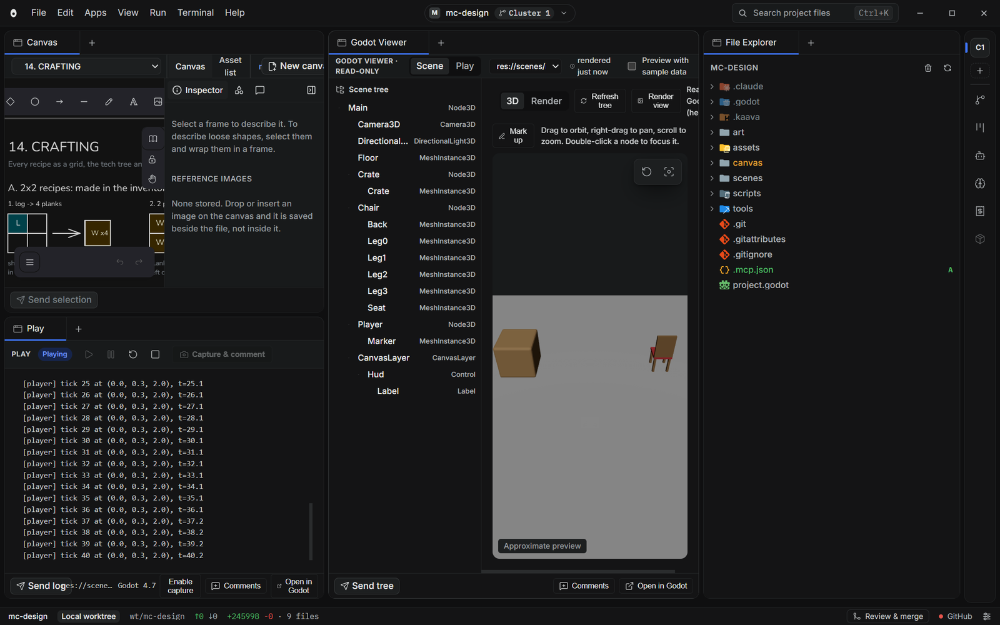
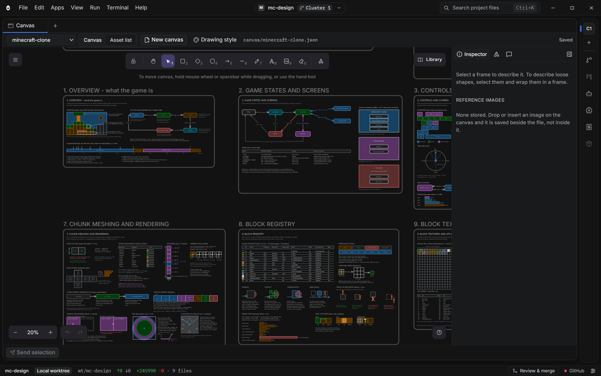
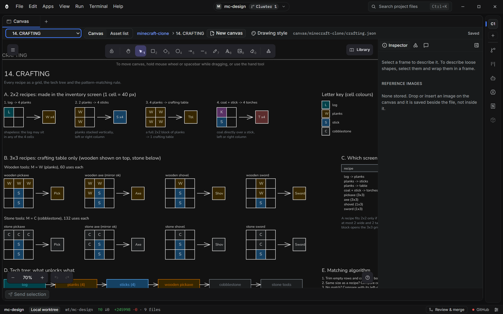
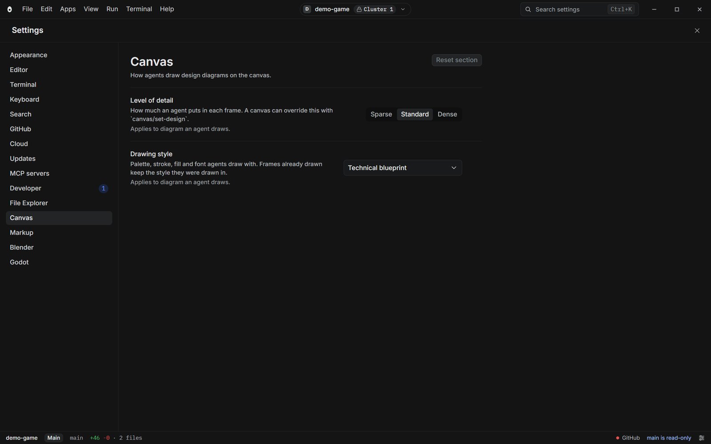
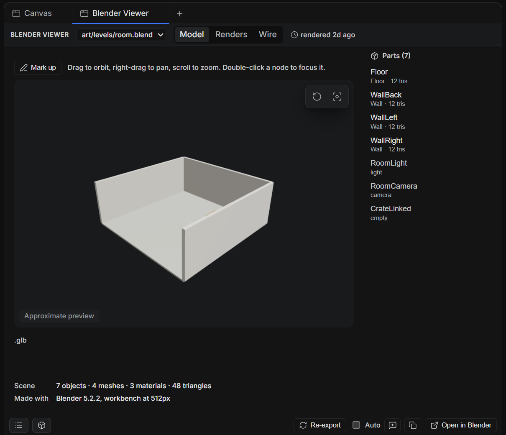
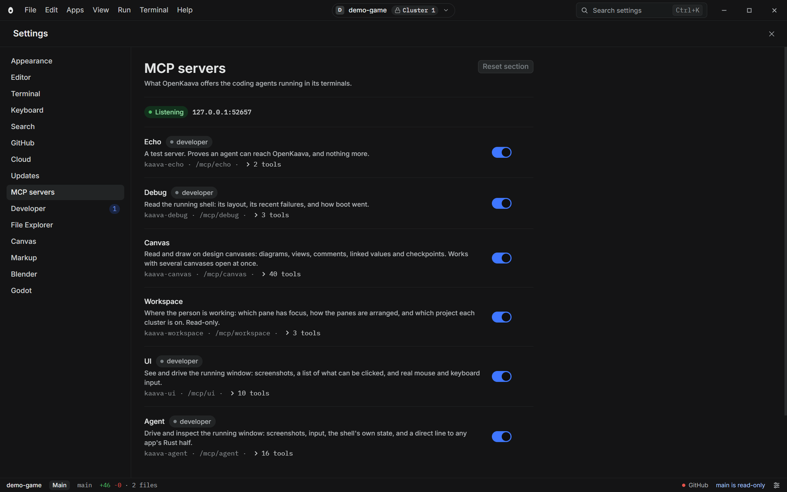

<div align="center">


# OpenKaava

<p>
  <strong>An Agentic Development Environment (ADE).</strong><br/>
  Built for game development, and general enough for any project.<br/>
  Clusters, terminals, a design canvas, Godot, Blender, and your coding agents in one window.
</p>

<p>
  <a href="https://github.com/Firelight-Innovations/OpenKaava/actions/workflows/verify.yml"></a>
  <a href="https://github.com/Firelight-Innovations/OpenKaava/stargazers"></a>
  <a href="LICENSE"></a>
  
  <a href="#status"></a>
</p>

<p>
  <a href="docs/user/tutorials/README.md"><ins>Tutorials</ins></a> &middot;
  <a href="docs/user/README.md"><ins>User docs</ins></a> &middot;
  <a href="docs/dev/README.md"><ins>Developer docs</ins></a> &middot;
  <a href="https://github.com/Firelight-Innovations/OpenKaava/discussions"><ins>Discussions</ins></a>
</p>

</div>

---

## What OpenKaava is

OpenKaava is an Agentic Development Environment (ADE): a desktop app that puts
your terminals, your files, a design canvas and your game tools in one window,
beside the coding agents you already use (Claude Code, Codex).

It is built for game development first. The Godot and Blender integrations and
the design canvas exist because that is the work it was made for. The rest
(clusters, terminals, files, git, MCP servers) is not tied to games, so with
some tweaks it works for ordinary software too.

OpenKaava is a development tool. It does not run the software you build with it.

## Status

OpenKaava is **alpha**. The features below run today, but expect rough edges,
changing behavior and bugs. It is Windows only. Parts marked **preview** or
**coming soon** are not finished, and the list is plain about which is which.

## What it does

### Clusters, worktrees and agent terminals

A cluster is one workspace: a project, a git worktree, and its own layout of
panes and terminals. Split panes freely and run Claude Code or Codex in a
terminal pane. Switch clusters and the panes and terminals swap together. The
main branch is read-only; work happens in worktrees, so several agents can work
on one repository without colliding.



### Design canvas

The canvas is where you and your agents draw designs. Frames nest into
sub-canvases, so a game's design can be split into one canvas per system. Each
frame can carry a spec card, and the asset list gathers what the design needs
to have built.

Leave comments on the canvas and they go to your agents, which read them, edit
the drawing and reply: a comment loop between you and the agent. Settings
control the level of detail and the drawing style agents use, and a design-agent
prompt tells an agent how to draw.







### Godot

OpenKaava drives the headless Godot CLI. You need Godot installed; OpenKaava
does not bundle it.

- **Godot Viewer** shows the scene tree and a 3D preview. The preview is
  approximate, not Godot's own renderer.
- **Play** runs the project's main scene and streams its log into a pane.
- **Open in Godot** hands the scene to the Godot editor.
- **Send to agent** puts a scene tree or log on the agent's context.

### Blender

OpenKaava drives headless Blender. You need Blender installed.

- **Blender Viewer** exports a `.blend` to `.glb` and shows the model, with a
  parts list and renders.
- **Markup and Send to agent** let you mark up a view and send it to an agent.
- **Open in Blender** opens the file in Blender itself.



### Files, context and sending things to agents

The File Explorer and File Viewer open any project file. Files, scenes, logs
and canvas selections can be kept as **context items** and sent to an agent
with **Send to agent**, instead of pasted into a terminal by hand.

### Plane project management

The Projects page shows the work items of a Plane workspace, so planning sits
next to the work. **Preview:** it reaches Plane through the OpenKaava Cloud
gateway, so it needs a cloud setup that is not generally available yet.

### MCP servers

OpenKaava hosts MCP (Model Context Protocol) servers and writes them into
`.mcp.json`, so your coding agent can call them. They cover the canvas, the
workspace and design tools. Each server has its own switch under
Settings, MCP servers. [The MCP server manager](docs/mcp-server-manager.md)
explains each one.



### Cost tracker

The Cost Tracker estimates what your OpenKaava Cloud resources have cost this
month at list price, forecasts the month against a budget, and shows what
Google has billed beside it. An estimate, not a bill. **Preview:** it is only
useful with a cloud setup.

### Search, git and settings

`Ctrl+K` searches the project and `Ctrl+Shift+P` opens the command palette. A
source control panel shows branch, staged and unstaged changes, and takes a
commit message. Every setting comes from one schema.

## Coming soon

- **Cloud agents.** Running agents on cloud machines, with a page to watch
  their sessions, machines and workflows. This is **not shipped**. A preview
  exists, but it is not usable yet.

## Known limits

- **Nothing is signed.** Windows SmartScreen warns about the installer. You
  have to click through it.
- **Windows only.** macOS and Linux are untested, not excluded.
- **Godot and Blender previews are approximate.** Open the real editor for
  anything that has to be exact.
- **Help, Documentation** has nothing published to point at yet.

## Install

**[Download OpenKaava for Windows](https://github.com/Firelight-Innovations/OpenKaava/releases/latest/download/OpenKaava-setup.exe)**

Run the installer. It does not ask for administrator rights. It installs for
your account only. OpenKaava also fetches the WebView2 runtime for you, if your
machine does not already have it.

> **Windows will warn you. You can go ahead.** The installer is not signed.
> SmartScreen shows "Windows protected your PC" and hides the button. Click
> **More info**, then **Run anyway**. A signing certificate costs money that an
> alpha does not yet justify. [Releases and
> updates](docs/dev/releases.md#what-still-does-not-exist) explains what
> signing would and would not fix.

After installing, right-click any folder in Explorer and choose **Open with
OpenKaava**. OpenKaava opens the folder as a project. The same entry appears on files.
A file opens in the File Viewer, with its folder as the project.

## Build from source

Use this option to build OpenKaava yourself, or to contribute code to it.

Every prerequisite below is a Windows prerequisite. Install each one once.

- **Rust** (stable): `winget install Rustlang.Rustup`
- **MSVC build tools**: install Visual Studio Build Tools 2022. Choose the
  *Desktop development with C++* workload. Rust needs the MSVC linker on
  Windows.
- **WebView2 runtime**: Windows 11 already has this.
- **Node 20+** and **pnpm**: run `npm i -g pnpm`.

Then run:

```sh
git clone https://github.com/Firelight-Innovations/OpenKaava.git
cd OpenKaava
pnpm install
pnpm app
```

The first `pnpm app` command compiles the whole Rust dependency tree. This
step takes several minutes. Later runs are fast.

## Learn your way around

[Ten short tutorials](docs/user/tutorials/README.md) cover the window, panes
and clusters, files, search, terminals, git, MCP servers, and settings. OpenKaava
ships the same ten pages in its own Tutorials tool. Read each tutorial beside
the thing it describes.

Start with [The OpenKaava window](docs/user/tutorials/the-window.md).

## The stack

OpenKaava is multi-repo by design: a tool with its own repository, its own release
cadence, and its own checkout beside this one, pinned to an exact version in
`kaava.toml`. That stays the model for a genuinely third-party tool — it is why
`kaava.toml` and `catalog.toml` both keep working with zero rows rather than
being deleted (see their headers).

Schematify is not that kind of tool, though. It lives in this repository,
under `apps/`, and ships in the same binary as Home and the File Explorer
rather than as a separate checkout — see [`apps/README.md`](apps/README.md)
for what that distinction means. That
leaves `kaava.toml`'s `[[tool]]` array empty today: there is nothing pinned,
and nothing for the switcher bar's health badge to report on, which is the
badge's normal silent state rather than a sign that something failed to load.
[The stack, end to end](docs/user/tutorials/the-stack.md) is what that badge
means and how to read it once something is pinned there again.

## Contributing

Pull requests are welcome. Read [CONTRIBUTING.md](CONTRIBUTING.md) first. It
explains how to get a build running, the four checks every pull request must
pass, and what we will not accept.

Then read the [developer docs](docs/dev/README.md). These pages cover the
technical details:

- [How the orchestrator is built](docs/dev/architecture.md)
- [The rule book](STANDARDS.md)
- [The tool protocol](docs/tool-protocol.md)
- [What exists around releases](docs/dev/releases.md)

The maintainer builds two pieces directly: the app download system and
Schematify. This is not a closed door. Nobody should spend a weekend on a
foundation that already has an owner. Outside contributions fit best as
features and quality-of-life work on top of those two pieces. A roadmap and
a set of starter issues are coming. They will point to exactly where.

Found a bug? Open an issue. Want something that is not here? Open an issue
too. Want to talk about an idea first? Open a
[discussion](https://github.com/Firelight-Innovations/OpenKaava/discussions).

## License

OpenKaava uses the Apache-2.0 license. [LICENSE](LICENSE) has the full text.
[NOTICE](NOTICE) is the file that a redistributor must carry with it.

OpenKaava uses Apache, not MIT, because of the patent grant. Third-party tools
load into OpenKaava through the tool protocol. MIT says nothing about patents.
OpenKaava does not use GPL or AGPL, under any circumstances. A copyleft license
would give someone a real argument that private tools mounting into OpenKaava are
derivative works.

The license covers the code. It does not cover the names. OpenKaava and
Schematify, and the marks that go with them, are trademarks of Firelight
Innovations.

You can fork OpenKaava. You can sell what you build on it. State plainly that your
work is based on OpenKaava. All of that is fine.

Do not ship your fork as OpenKaava itself. The code is free to copy. The name is
not. The name tells a user which build runs the tools on their machine.
