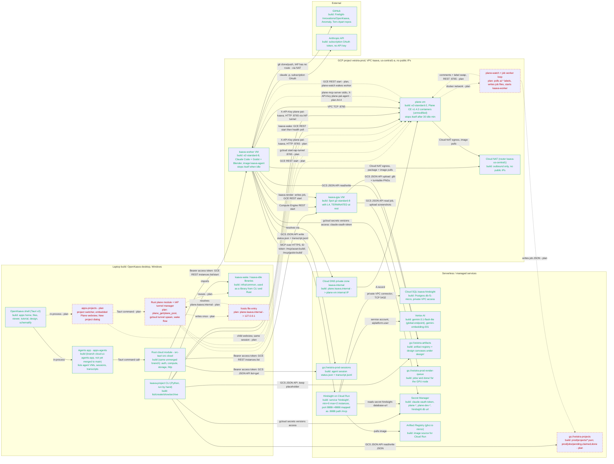
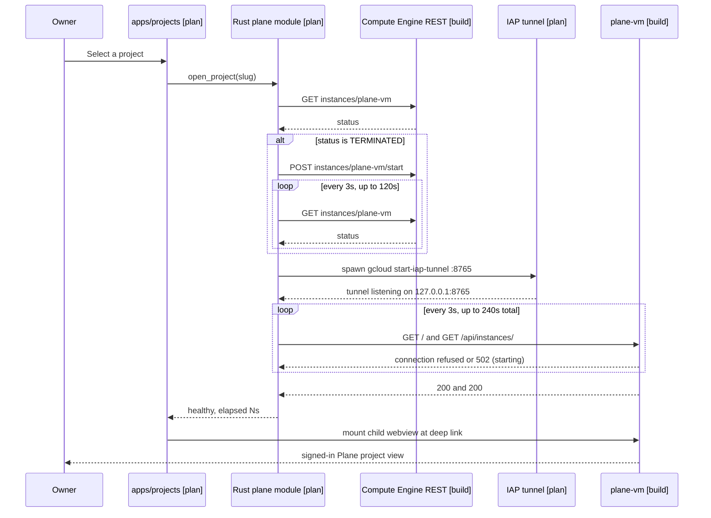
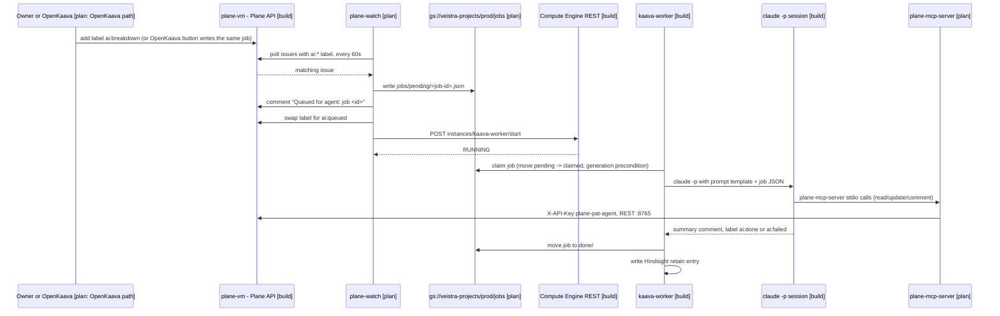

# OpenKaava Cloud: system diagram

What exists in `veistra-prod` today, how the pieces talk to each other, and how the OpenKaava
desktop app (and the tools that stand in for its unbuilt parts) reach them. Built today = solid
edges. Planned = dashed edges. Every node and edge below is labeled `[build]` or `[plan]`.

Sources are cited in the table at the bottom. Where a source contradicts the brief this diagram
was built from, the contradiction is called out in that table and in the summary handed back with
this file — this diagram follows the newer, more specific sources (Terraform, the Plane-frontend
handoff) over the older status banner in `docs/cloud-services.md`.

## 1. Main system diagram

## 2. Sequence: open Plane from OpenKaava (planned end state)

## 3. Sequence: `ai:*` label to worker to Plane comment (planned)

## 4. Legend

| Style | Meaning |
|---|---|
| Solid arrow, green node border | Built today: the code exists (in this worktree, in `main`, or on a named branch) and, per the sources below, the resource is deployed |
| Dashed arrow (`-.->`), red node border, `[plan]` | Planned: designed but not written, or written but not wired up end to end |
| `classDef built` / `classDef planned` | Applied per node; edges are annotated `[build]`/`[plan]` in their label or in prose above |

Two built things sit in an unusual place and are called out individually rather than folded into
"built" or "planned":

- **The Agents app** (`apps/agents`, `src-tauri/src/cloud/*`) is fully written and uses the real
  mechanism this document describes — `gcloud auth print-access-token`, Compute Engine REST list
  and start, Cloud Storage JSON API list and download — but it lives on branch
  `cloud-ui/agents-app`, which is **not merged into `main`** and not present in this worktree
  (`tools/kaava-project`). It is drawn as built because the mechanism is real and demonstrated, not
  because it ships today.
- **`kaava-project` (Python CLI)** is the thing that actually creates/lists/shows/archives
  projects today. It is not part of the OpenKaava desktop app; it is a terminal tool the owner (or
  an agent on the worker) runs by hand. `apps/projects` is meant to replace the parts of it that
  touch the UI (B3.1), but until B1-B3 land, the CLI is the only "project" surface that exists.

## 5. Node and edge to source map

| Node / item | Source |
|---|---|
| `veistra-prod`, VPC `kaava`, Cloud NAT, IAP-only firewall | `infra/terraform/foundation/main.tf` (`google_compute_network.kaava`, `google_compute_router_nat.kaava`, `google_compute_firewall.iap_ingress`) |
| `kaava-worker` VM, agent image, idle stop | `infra/terraform/worker/main.tf` (`google_compute_instance.agent`, var `agents`, default `e2-standard-8`); `infra/images/agent/` |
| `kaava-gpu` VM, Spot L4, TERMINATED at rest | `infra/terraform/gpu/main.tf` (`google_compute_instance.gpu`, `desired_status = "TERMINATED"`, `machine_type = "g2-standard-8"`) |
| `plane-vm`, disk `plane-data`, DNS, firewall | `infra/terraform/plane/main.tf` (`google_compute_instance.plane`, `google_compute_disk.data`, `google_dns_managed_zone.internal`, `google_compute_firewall.plane_iap`/`plane_agents`) |
| Plane CE v1.4.2 live, cold-start numbers, PATs | `docs/handoffs/plane-frontend.md` ("What is live" table) |
| Hindsight on Cloud Run + Cloud SQL + Vertex | `infra/terraform/hindsight/main.tf` (`google_cloud_run_v2_service.hindsight`, `google_sql_database_instance.hindsight`, env `HINDSIGHT_API_LLM_MODEL`) |
| Buckets `veistra-artifacts`, `-render-queue`, `-sessions`, `veistra-projects` | `infra/terraform/registry/main.tf`; `infra/terraform/plane/main.tf` (`google_storage_bucket_iam_member.projects`) |
| Secret Manager (`claude-oauth-token`, `plane-*`) | `infra/terraform/secrets/main.tf`, `infra/terraform/plane/main.tf` (`local.secrets`) |
| `kaavaWaker` custom role, wake/idle contract | `infra/terraform/plane/main.tf` (`google_project_iam_custom_role.waker`); `infra/common/kaava-wake/`, `infra/common/kaava-idle/` |
| `kaava-project` CLI, prod projects | `tools/kaava-project/kaava_project.py`, `tools/kaava-project/README.md` |
| UI-facing contracts (auth, artifact/session/canvas shapes, Hindsight rules) | `docs/cloud-services.md` |
| Agents app (built, unmerged) | `git show origin/cloud-ui/agents-app` — `src-tauri/src/apps/agents.rs`, `src-tauri/src/cloud/{mod,auth,compute,storage,http}.rs` |
| `apps/projects` (planned), design rules, deep links | `docs/design/OPENKAAVA-PLANE-DESIGN.md` §7.4, §11 (task table B1-B3); `docs/handoffs/plane-frontend.md` ("Not built yet") |
| `plane-watch`, AI job queue, job flow | `docs/design/OPENKAAVA-PLANE-DESIGN.md` §7.3, §8.1; `docs/handoffs/plane-frontend.md` ("Not built yet") |
| Local dev Plane `:8766` | `docs/design/OPENKAAVA-PLANE-DESIGN.md` §9; `docs/handoffs/plane-frontend.md` |
| Cost model, scale-to-zero targets | `docs/design/OPENKAAVA-PLANE-DESIGN.md` §4-§5; `infra/README.md` ("Cost at idle") |
| Overall PRD scope and phases | `docs/design/OPENKAAVA-CLOUD-PRD.md` |
